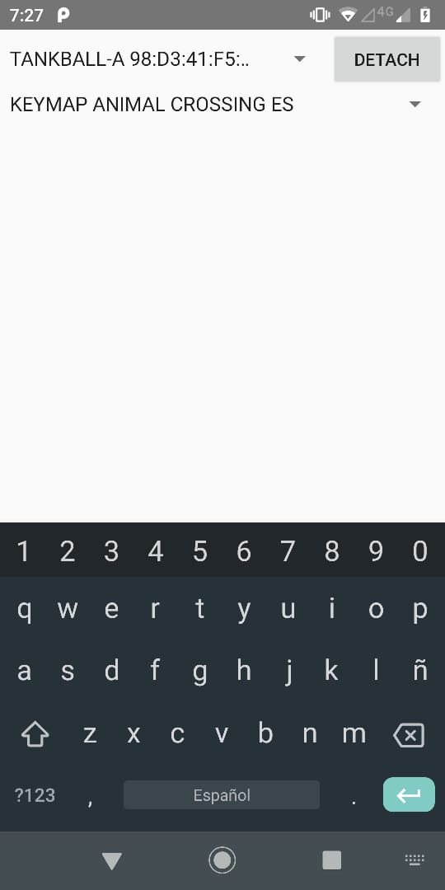

## bkeyboard

### Configurar Entorno
~~~
$ export ANDROID_HOME=/opt/android/sdk
$ ls $ANDROID_HOME
	- build-tools
	- platforms
	- platform-tools
	- tools
~~~

### Instalar Version Correcta de gradle
REF: https://developer.android.com/studio/releases/gradle-plugin#updating-gradle

~~~
En mi caso estoy utilizando la ultima hasta la fecha

Gradle version   Version de complemento
   5.6.4                3.5.3 

La version de complemento la busque en https://maven.google.com/web/index.html

usando la palabra clave aapt2 para ver la ultima version soportada para mi gradle
~~~

### Buscar e instalar el build tools 
REF: https://developer.android.com/studio/command-line/sdkmanager

~~~
Esto lo explican mejor que yo arriba xD... pero simplifico

busco las disponibles

$ sdkmanager --list | grep build-tools

instalo la que quiero

$ sdkmanager "build-tools;28.0.3"
~~~

### Compilar
~~~
$ gradle5.6.4 assembleDebug
~~~

### Compilar e instalar al mismo tiempo
~~~
$ gradle5.6.4 installDebug
~~~

### LOGS

~~~
V - Verbosa
D - Depuración
I - Información
W - Advertencia
E - Error
F - Fatal
S - Silencio
~~~

~~~
$ adb devices
$ sudo adb kill-server
$ sudo adb start-server
$
$ adb logcat "com.lowlevel.bkeyboard:V *:S"
~~~
